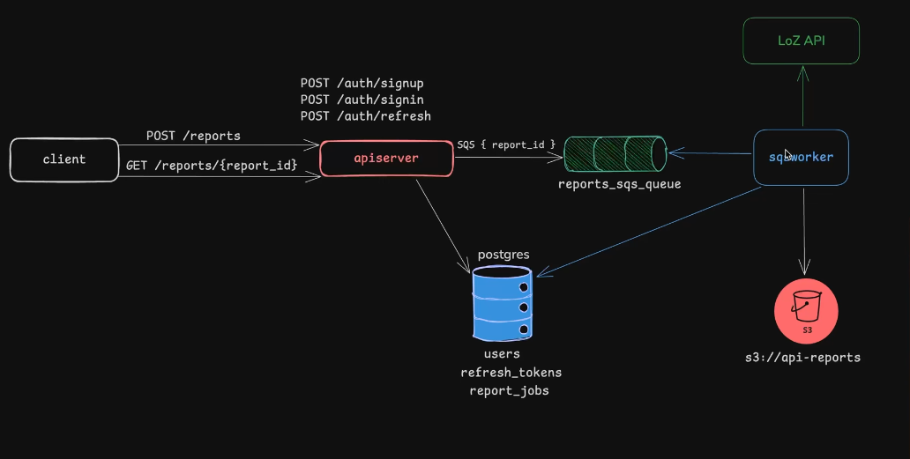

### QueueForge

A cloud-native asynchronous report generation API built with Go, PostgreSQL, Amazon SQS, and Amazon S3.

QueueForge is a scalable backend service designed to handle long-running report generation tasks without blocking client requests. The system leverages a message-driven architecture where report jobs are queued in Amazon SQS and processed asynchronously by worker services.

---

#### Overview

Generating reports can be computationally expensive and time-consuming. Instead of making users wait for report creation, QueueForge adopts an asynchronous processing model.

When a user requests a report:

1. The API creates a report record.
2. A report job is pushed to Amazon SQS.
3. The API immediately responds with a report ID.
4. Background workers consume jobs from the queue.
5. Workers fetch data from external services.
6. CSV reports are generated.
7. Generated reports are uploaded to Amazon S3.
8. Report status is updated in PostgreSQL.
9. Users can query the report status and retrieve the generated file.

---

### Architecture:

